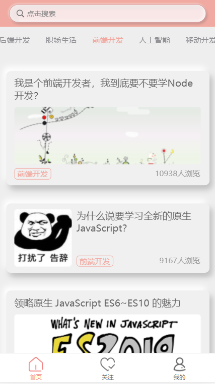
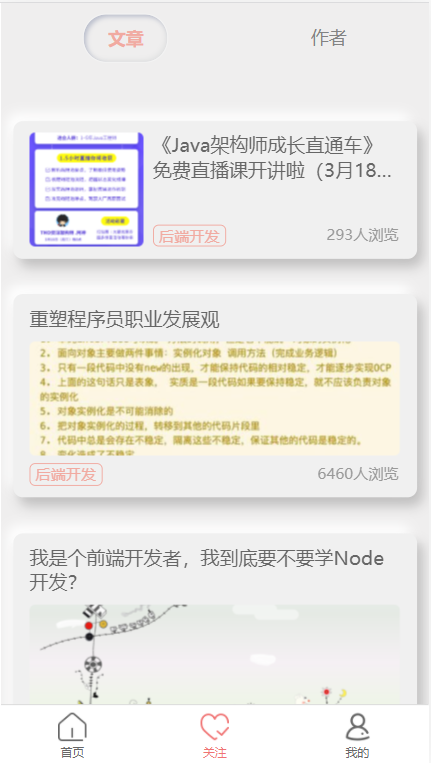
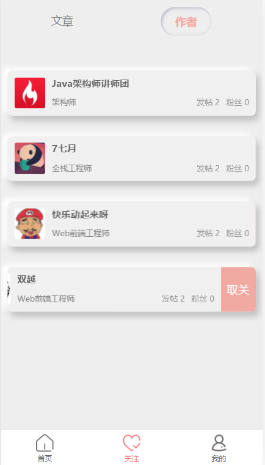
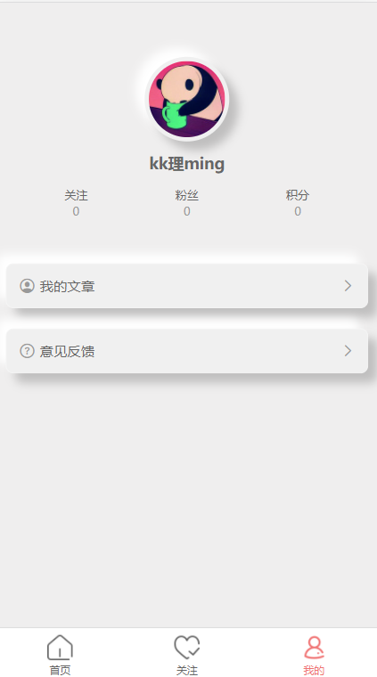
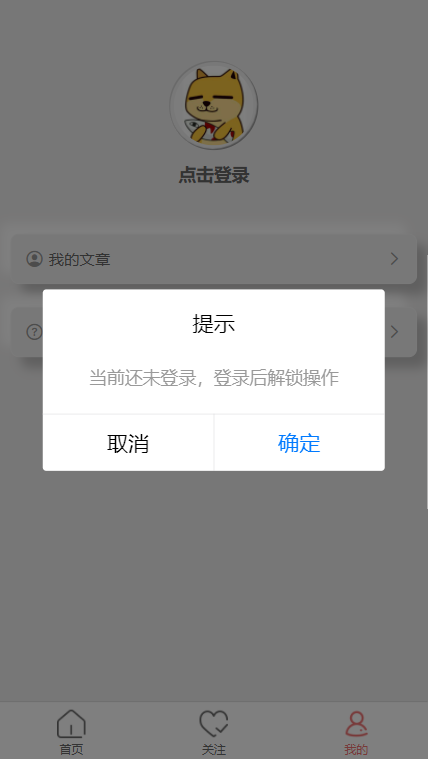
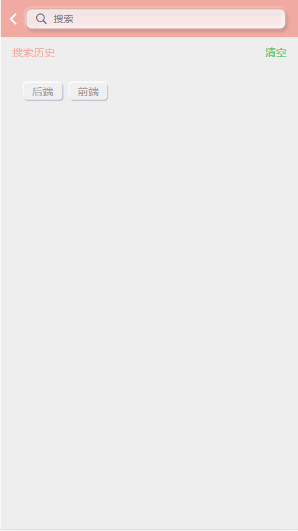
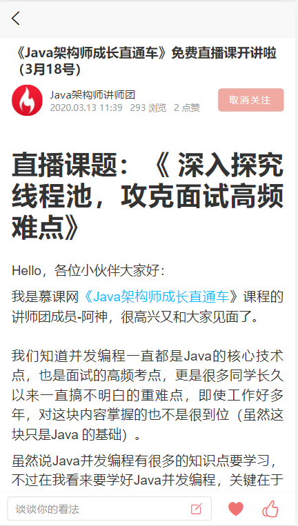
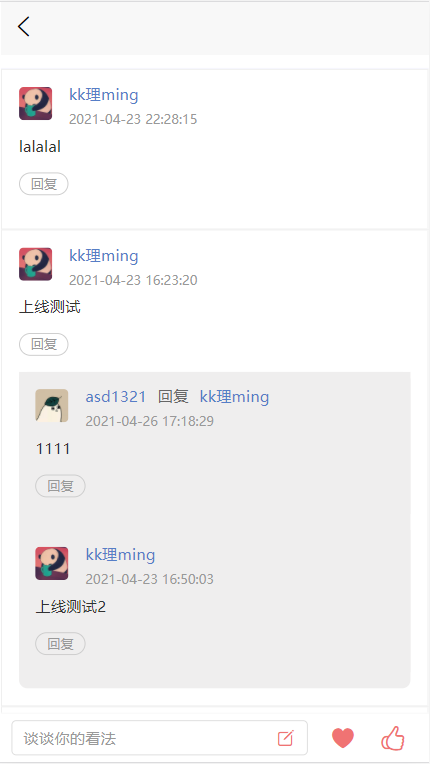

# news 阅读
### 一、背景
由于一直接触的是 PC 端项目，移动端接触较少。而平时开发多使用 Vue ，因此在选取移动端框架时优选了 uni-app。与其他框架相比，其学习成本相对较低，上手快还能顺便撩把一下小程序，就当前阶段而言是再适合不过了。

### 二、演示地址
github: [https://wynn-w.github.io/news/](https://wynn-w.github.io/news/)    
<!-- gitee: [https://wynn-w.gitee.io/news/](https://wynn-w.gitee.io/news/)  -->

### 三、运行截图
- **首页**

- **关注**

  

- **个人页**

  

- **搜索**

- **文章**

### 四、联系方式
邮箱：rzw1250@gmail.com

### 五、提示
如要运行本项目，请直接下载源代码。小程序端需要在 /stroe/index.js 文件下 wx().wxRegister() 方法中配置小程序 secretId 和 appId。 

### 六、声明
应用中展示的所有内容均搜集自互联网，若内容有侵权请联系作者进行删除处理。本应用仅用作分享与学习  
